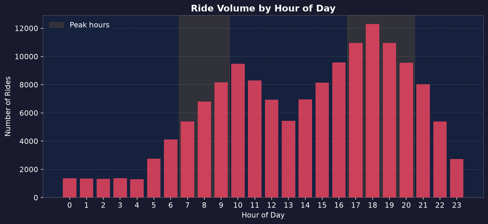
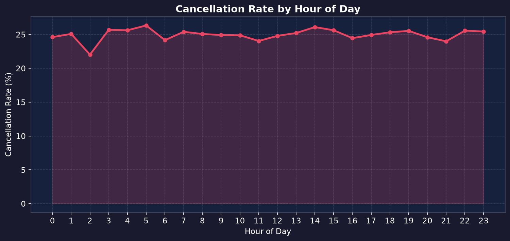
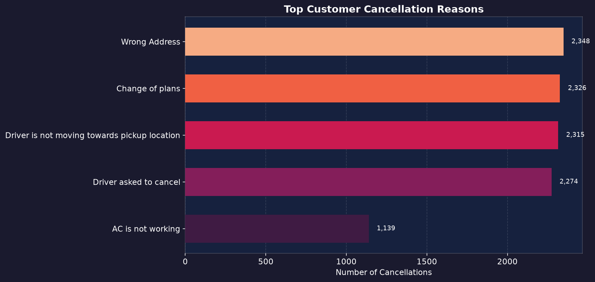
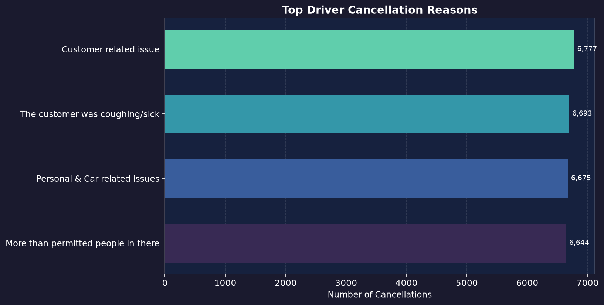
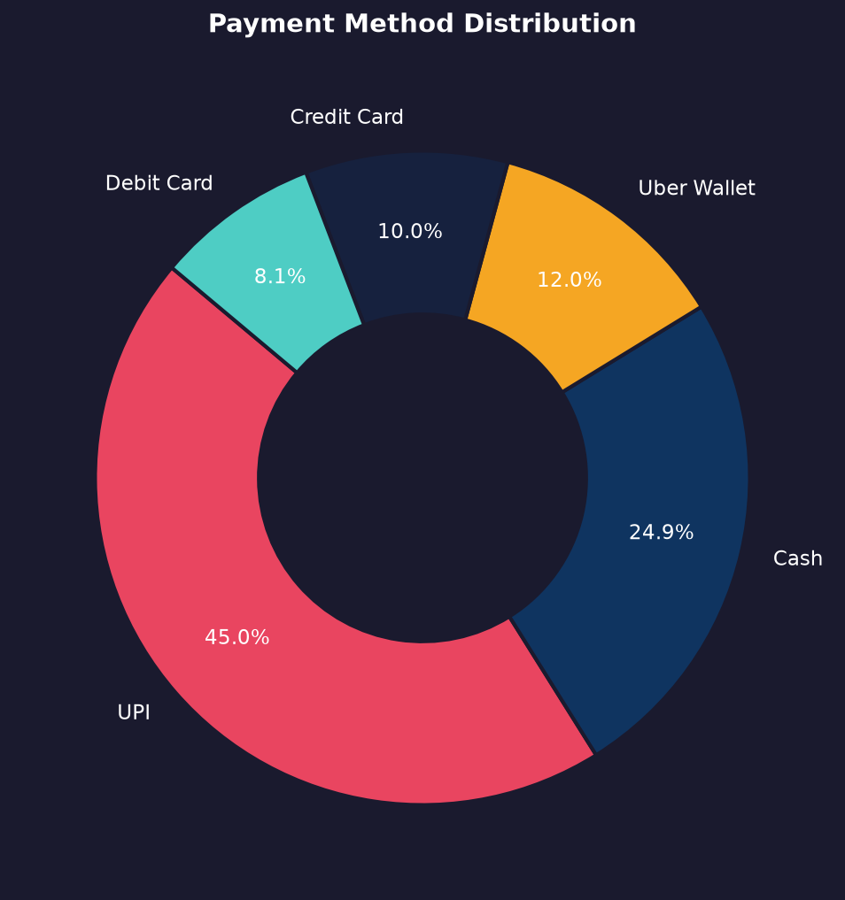
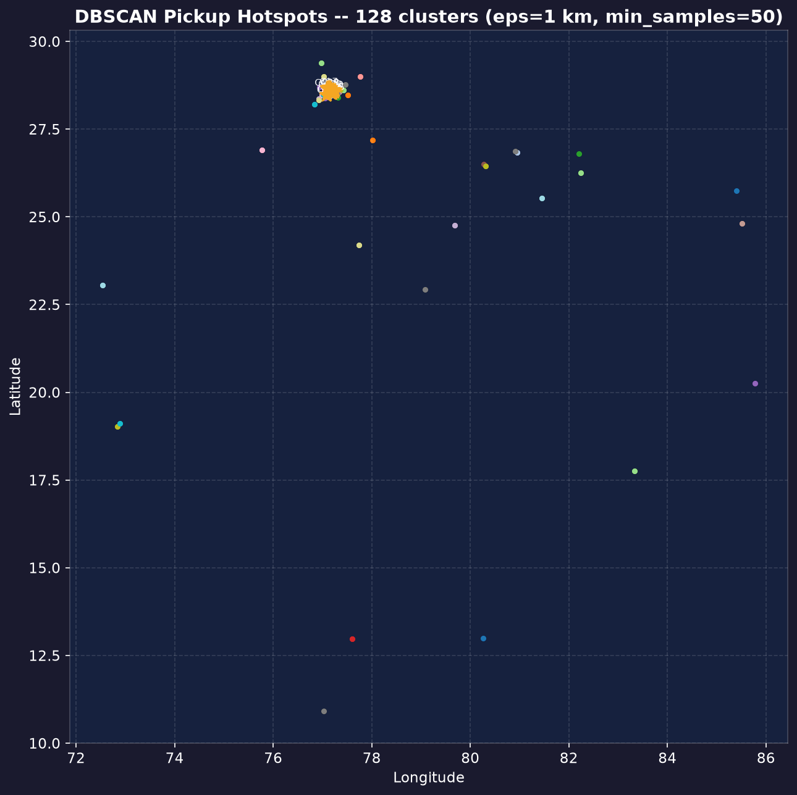
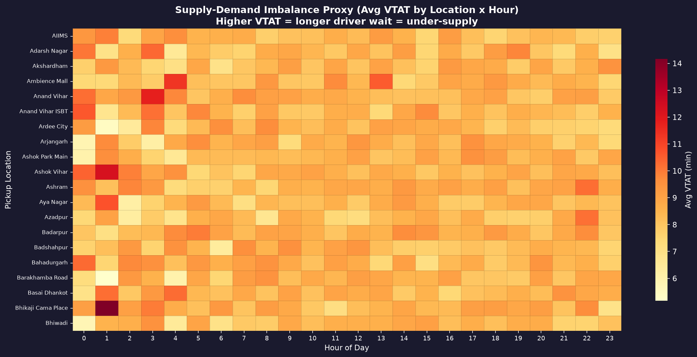
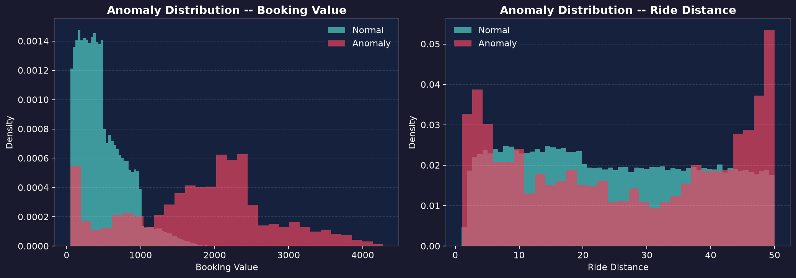

# Uber NCR Ride Analytics -- Business Intelligence Report

_Generated from `ncr_ride_bookings.csv` · 148,767 bookings · 2024-01-01 – 2024-12-30_

## Executive Summary

The Uber NCR dataset covers **148,767 ride bookings** across the National Capital Region (Delhi, Gurgaon, Noida, Faridabad).
Key headline metrics:

| Metric | Actual | Benchmark |
|--------|--------|-----------|
| Success Rate | 62.01% | 65.96% |
| Total Cancellation Rate | 25.00% | 25.00% |
| Customer Cancellations | 6.99% | 19.15% |
| Driver Cancellations | 18.01% | 7.45% |
| Average Fare | ₹508 | -- |
| Average Distance | 24.6 km | -- |

## 1. Fleet Performance by Vehicle Type

Vehicle type breakdown ordered by booking volume:

| Vehicle | Bookings | Cancel Rate | Avg Fare (₹) | Avg Distance (km) |

|---------|----------|-------------|--------------|-------------------|

| Auto | 37,129.0 | 24.9% | ₹507 | 24.6 |

| Go Mini | 29,556.0 | 24.9% | ₹508 | 24.6 |

| Go Sedan | 26,934.0 | 25.3% | ₹512 | 24.6 |

| Bike | 22,318.0 | 25.1% | ₹510 | 24.6 |

| Premier Sedan | 17,950.0 | 24.9% | ₹510 | 24.6 |

| eBike | 10,458.0 | 25.0% | ₹504 | 25.0 |

| Uber XL | 4,422.0 | 24.5% | ₹502 | 24.4 |

> **Finding:** `Auto` dominates bookings (37,129.0 rides). `Go Sedan` has the highest cancellation rate at 25.3%. **Recommendation:** Review driver incentives for the high-cancellation vehicle type.

## 2. Temporal Demand Patterns

- **Peak booking hour:** 18:00 with 12,298 rides
- **Peak-hour cancellation rate:** 25.1% vs off-peak 24.9%
- **Weekend vs Weekday:** weekdays drive higher volume

> **Finding:** Cancellation rates spike by **0.2%** during peak windows (7–10am, 5–9pm IST). **Recommendation:** Deploy dynamic surge pricing and pre-position drivers in high-demand zones 30 minutes before peak windows.

## 3. Cancellation Deep-Dive

**Top 3 Customer Cancellation Reasons:**

1. Wrong Address -- 2,348 instances

2. Change of plans -- 2,326 instances

3. Driver is not moving towards pickup location -- 2,315 instances

**Top 3 Driver Cancellation Reasons:**

1. Customer related issue -- 6,777 instances

2. The customer was coughing/sick -- 6,693 instances

3. Personal & Car related issues -- 6,675 instances

> **Finding:** Customer-side cancellations (7.0%) dominate over driver-side (18.0%). **Recommendation:** Implement in-app pre-booking messaging to set realistic ETAs and reduce 'driver not found' frustrations.

## 4. Payment Method Insights

| Payment Method | Share |

|----------------|-------|

| UPI | 45.0% |

| Cash | 24.9% |

| Uber Wallet | 12.0% |

| Credit Card | 10.0% |

| Debit Card | 8.1% |

> **Finding:** `UPI` is the dominant payment method (45.0% share). **Recommendation:** Offer `UPI` cashback promotions during off-peak hours to stimulate demand.

## 5. Geospatial Demand Hotspots

**Top 5 Pickup Zones by Volume:**

| Rank | Zone | Bookings |

|------|------|----------|

| 1 | Khandsa | 947 (23.9% cancel) |

| 2 | Barakhamba Road | 939 (24.1% cancel) |

| 3 | Saket | 929 (26.8% cancel) |

| 4 | Pragati Maidan | 912 (27.0% cancel) |

| 5 | Badarpur | 912 (25.2% cancel) |

> **Finding:** **Khandsa** accounts for the highest ride volume with a cancellation rate of **23.9%**. **Recommendation:** Allocate dedicated driver pools and apply dynamic incentive allocation for this zone during peak hours.

_Interactive maps available in `output/geo/`:_

- [Pickup Heatmap](output/geo/pickup_heatmap.html)

- [H3 Demand Hex Grid](output/geo/h3_demand_hex.html)

- [OD Flow Map](output/geo/od_flow_map.html)

- [Animated Hourly Demand](output/geo/demand_animation.html)

## 6. Supply-Demand Imbalance (VTAT Proxy)

Average Vehicle Time to Arrival (VTAT) by hour -- higher VTAT = drivers under-supplied:

| Hour | Avg VTAT (min) |

|------|---------------|

| 15:00 | 8.5 |

| 04:00 | 8.5 |

| 02:00 | 8.5 |

| 08:00 | 8.5 |

| 11:00 | 8.5 |

> **Finding:** Hour **15:00** has the worst supply-demand imbalance (VTAT = 8.5 min). **Recommendation:** Trigger driver recruitment campaigns and bonus incentives during this window.

## 7. Anomaly Detection

Isolation Forest (contamination=2%) flagged **2024** anomalous bookings with unusual fare/distance combinations. These warrant manual review for potential fraud or data entry errors.

## 8. Demand Forecasting (Prophet)

Forecasted demand (next 30 days) for top pickup zones:

| Zone | Predicted Daily Rides | Lower | Upper |

|------|----------------------|-------|-------|

| Khandsa | 2 | 0 | 4 |

| Barakhamba Road | 2 | -0 | 3 |

| Saket | 1 | -1 | 3 |

| Pragati Maidan | 3 | 2 | 5 |

> **Recommendation:** Use zone-level forecasts to pre-schedule driver shifts 48 hours ahead, targeting high-demand windows.

## 9. Strategic Recommendations

| # | Recommendation | Priority | Expected Impact |
|---|---------------|----------|-----------------|
| 1 | Pre-position drivers in top-5 hotspot zones 30 min before peak windows | High | Reduce VTAT, cut cancellations |
| 2 | Dynamic surge pricing during peak hours in under-supplied zones | High | Revenue ↑, demand balancing |
| 3 | In-app ETA communication overhaul to reduce customer cancellations | High | Customer cancel rate ↓ ~3–5% |
| 4 | Driver incentive programme for high-cancellation vehicle types | Medium | Driver cancel rate ↓ |
| 5 | UPI/Wallet cashback promotions during off-peak hours | Medium | Off-peak demand ↑ |
| 6 | Automated anomaly alerting pipeline for fare outliers | Low | Fraud prevention |
| 7 | Weekly zone-level demand forecast distribution to driver ops team | Low | Supply-demand alignment |

## Appendix -- Deliverables Checklist

| Deliverable | Location | Status |
|-------------|----------|--------|
| `cleaned_uber_data.csv` | `data/` | [DONE] |
| `locations_geocoded.csv` | `data/` | [DONE] |
| EDA charts (12 PNGs) | `output/eda/` | [DONE] |
| Geospatial HTML maps | `output/geo/` | [DONE] |
| `hotspot_clusters.csv` | root | [DONE] |
| `forecast_results.csv` | root | [DONE] |
| `app.py` (Streamlit dashboard) | root | [DONE] |
| `report.md` | root | [DONE] |

